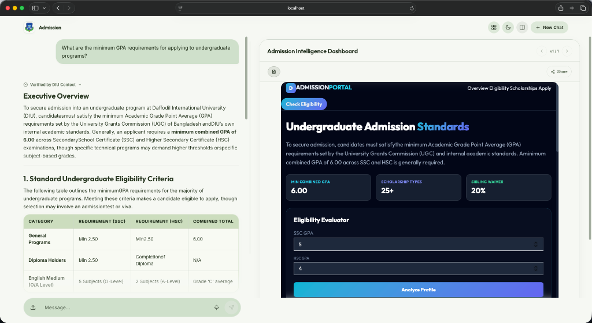

# DIU Assistant

<div align="center">

**A state-of-the-art Gemini-powered assistant for Daffodil International University.**

</div>

---



DIU Assistant is a modern React + Vite web application featuring a Gemini-powered backend. It is designed to assist with admissions, academic programs, scholarships, fees, and university documentation through an intuitive, interactive interface.

## Dashboard Experience

The DIU Assistant features an advanced "Canvas" system that generates real-time, interactive dashboards for complex university data.

- **Real-time Eligibility Evaluators**: Calculate your waiver and eligibility instantly.
- **Deep Data Visualization**: High-fidelity charts and tables for admission standards.
- **Context-Aware Design**: Perfectly matches your current conversation topic.

## Group 1 Alignment

This repository is organized around the Group 1 "University Knowledge Assistant" track from the course handbook:

- **Project 1 - Campus FAQ Chatbot**: DIU policy and university Q&A through the indexed campus knowledge base.
- **Project 2 - RAG-based University Assistant**: document upload, chunking, retrieval, and answer grounding for handbook-like sources.
- **Project 3 - Agentic University Assistant**: specialist admission, course, and scholarship modes layered on the shared assistant workflow.

The handbook's folder structure is a suggested baseline, so this repo keeps the same concepts in a web-app-friendly layout:

- `data/raw/` and `data/processed/` separate source inputs from prepared knowledge assets.
- `src/` contains the retrieval, prompting, and API logic that a generic `src/` folder would usually hold.
- `frontend/` serves the same purpose as a generic `app/` folder, but split for React + Vite deployment.
- `docs/` is reserved for submission artifacts and deployment notes.


## Stack

- `frontend/`: React 18 + Vite UI
- `backend/main.py`: Python HTTP API used locally and as the permanent production backend source
- `src/`: backend logic organized into `api/`, `apps/`, and `core/` subpackages
- `supabase/`: schema and production policy SQL
- `data/`: raw inputs and processed DIU knowledge data
- `docs/`: submission-facing architecture, deployment, and report materials
- `scripts/`: maintenance, indexing, and log review helpers
- `tests/`: backend test suite plus lightweight frontend unit tests

## Directory Map

```text
.
├── backend/
│   ├── main.py
│   └── src/
│       ├── api/
│       │   └── errors.py
│       ├── apps/
│       │   ├── canvas/
│       │   │   └── services/
│       │   │       └── artifacts.py
│       │   └── documents/
│       │       └── rag/
│       │           ├── ingestion.py
│       │           └── pipeline.py
│       ├── core/
│       │   ├── config.py
│       │   ├── gemini.py
│       │   └── knowledge.py
├── frontend/
│   ├── public/
│   ├── src/
│   │   ├── apps/
│   │   │   ├── canvas/
│   │   │   ├── chat/
│   │   │   │   ├── components/
│   │   │   │   ├── hooks/
│   │   │   │   └── services/
│   │   │   ├── layout/
│   │   │   └── voice/
│   │   ├── utils/
│   │   ├── styles/
│   │   │   └── index.css
│   │   ├── App.jsx
│   │   └── main.jsx
│   ├── package.json
│   └── vite.config.js
├── data/
│   ├── raw/
│   └── processed/
│       └── daffodil_site_index.json
├── docs/
│   ├── architecture.md
│   ├── deployment.md
│   ├── observability.md
│   ├── project_report_outline.md
│   ├── submission_checklist.md
│   └── README.md
├── scripts/
├── tmp/
│   ├── canvas_artifacts/
│   └── uploaded_contexts/
├── requirements.txt
└── CHANGELOG.md
```

## Environment Setup

1. Copy the example env files:
   - `.env.example` -> `.env`
   - `frontend/.env.example` -> `frontend/.env`
2. Create or connect a Supabase project if you want persistent storage.
3. Run `supabase/schema.sql` in Supabase if you need the database objects.

Root `.env`:

```bash
GEMINI_API_KEY=your_gemini_api_key_here
GEMINI_API_KEYS=
GEMINI_MODEL=gemini-3-flash-preview
GEMINI_FALLBACK_MODELS=
GEMINI_TRANSCRIBE_MODEL=gemini-3-flash-preview
GEMINI_TRANSCRIBE_FALLBACK_MODELS=
GEMINI_ENABLE_SEARCH=true
GEMINI_MAX_RETRY_AFTER_SECONDS=0
GEMINI_MAX_OUTPUT_TOKENS=32768
GEMINI_TRANSCRIBE_MAX_OUTPUT_TOKENS=160
GEMINI_CONTEXT_CHARS=0
GEMINI_TIMEOUT_SECONDS=60
GEMINI_TRANSCRIBE_TIMEOUT_SECONDS=15
ALLOWED_ORIGINS=http://localhost:5173,http://127.0.0.1:5173,http://localhost:5174,http://127.0.0.1:5174
MAX_JSON_BODY_BYTES=146800640
DIU_SITE_MAX_PAGES=1000
APP_TITLE=DIU Assistant
APP_TAGLINE=Gemini-powered DIU assistant for admissions, programs, scholarships, fees, and university documents.
API_HOST=127.0.0.1
API_PORT=8765
SUPABASE_URL=https://your-project.supabase.co
SUPABASE_SERVICE_ROLE_KEY=your_service_role_key_here
SUPABASE_ANON_KEY=your_anon_key_here
SUPABASE_SESSION_ID=default
SUPABASE_DOCUMENT_TABLE=document_chunks
SUPABASE_MATCH_RPC=match_document_chunks
```

`frontend/.env`:

```bash
VITE_SUPABASE_URL=https://your-project.supabase.co
VITE_SUPABASE_ANON_KEY=your_anon_key_here
VITE_API_URL=
```

Leave `VITE_API_URL` blank for local development so the frontend talks to the local Python API at `http://127.0.0.1:8765`.

## Install

```bash
npm install
npm --prefix frontend install
pip install -r requirements.txt
```

## Local Development

Run frontend and API together from the repo root:

```bash
npm run dev
```

Useful individual commands:

```bash
npm run dev:api
npm run dev:frontend
npm run build
npm run preview
```

The app usually runs at `http://localhost:5173/` and the local API at `http://127.0.0.1:8765/`.

For microphone support, use `localhost` or HTTPS.

## Knowledge Refresh

Refresh the backend DIU website index:

```bash
npm run refresh:knowledge
```

This updates:

- `data/processed/daffodil_site_index.json`

## Tests

Run the full suite:

```bash
npm test
```

Run only frontend tests:

```bash
npm run test:frontend
```

Run only backend tests:

```bash
npm run test:backend
```

## Deployment

The recommended production setup is to deploy the Python backend and a static frontend.

The starter service definition for that permanent backend is in [render.yaml](/Users/schrodingersmac/Desktop/DIU%20Assistant/render.yaml).

Submission-facing notes:

- Architecture: [docs/architecture.md](/Users/schrodingersmac/Desktop/DIU%20Assistant/docs/architecture.md)
- Deployment note: [docs/deployment.md](/Users/schrodingersmac/Desktop/DIU%20Assistant/docs/deployment.md)
- Observability routine: [docs/observability.md](/Users/schrodingersmac/Desktop/DIU%20Assistant/docs/observability.md)


## Runtime Files

The repo intentionally keeps the `tmp/`, `tmp/uploaded_contexts/`, and `tmp/canvas_artifacts/` directories in place for local runtime behavior, but generated contents inside them are ignored and can be safely cleared.

Observability runtime files:

- `tmp/logs/backend_events.jsonl`

Also ignored:

- `.env` files
- `node_modules/`
- `frontend/dist/`
- `output/` generated report artifacts
- Python cache files
- local logs

## Notes

- The frontend stores conversations in Supabase when configured, and falls back to browser-local storage when not.
- The modular frontend architecture is organized into domain-specific apps under `frontend/src/apps/`.
- Uploaded-document runtime context is kept under `tmp/uploaded_contexts/` during local use.
- Canvas artifact HTML files are generated under `tmp/canvas_artifacts/` during local use.
- Backend observability logs are written to `tmp/logs/backend_events.jsonl`.
- Local helper caches under `frontend/dist/` and `output/` are disposable build artifacts, not source of truth.
- Visual RAG (side-by-side document viewer) utilizes `TextRenderer` with PDF iframe support.
- Keep secrets only in `.env` files and never commit them.
