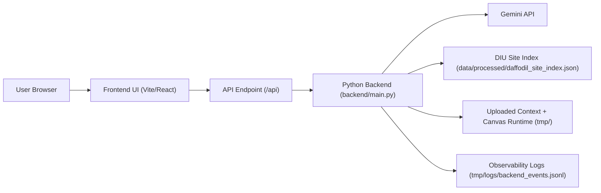

# Architecture

## Short Diagram

## Runtime Roles

- `frontend/`: user interface, chat flow, upload flow, and browser-side fallbacks
- `backend/main.py`: main HTTP API for chat, upload, health, transcribe, and canvas artifact serving
- `src/core/knowledge.py`: DIU retrieval and grounding selection
- `src/core/gemini.py`: Gemini prompting, grounding, and streaming behavior
- `data/processed/daffodil_site_index.json`: prepared DIU knowledge index used for official-source grounding
- `tmp/`: local runtime state for uploaded text, canvas artifacts, and observability logs

## Submission Notes

- The production architecture now matches the intended long-term model: `static frontend + permanent Python backend`.
- The frontend stays static and lightweight.
- The backend remains the single source of truth for DIU retrieval, uploads, and model behavior.
